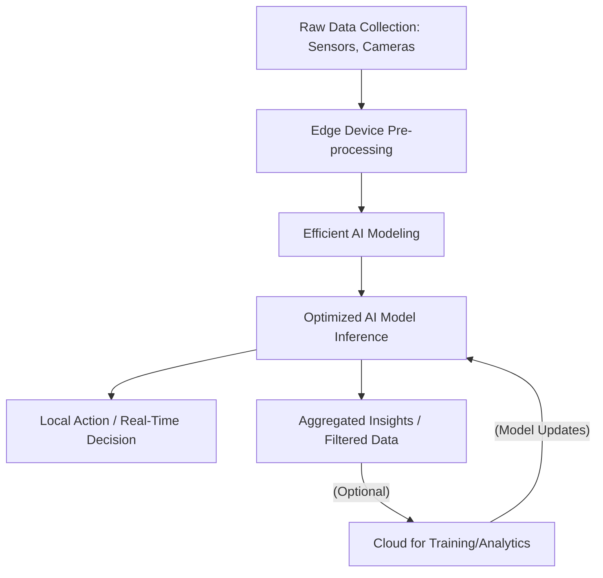
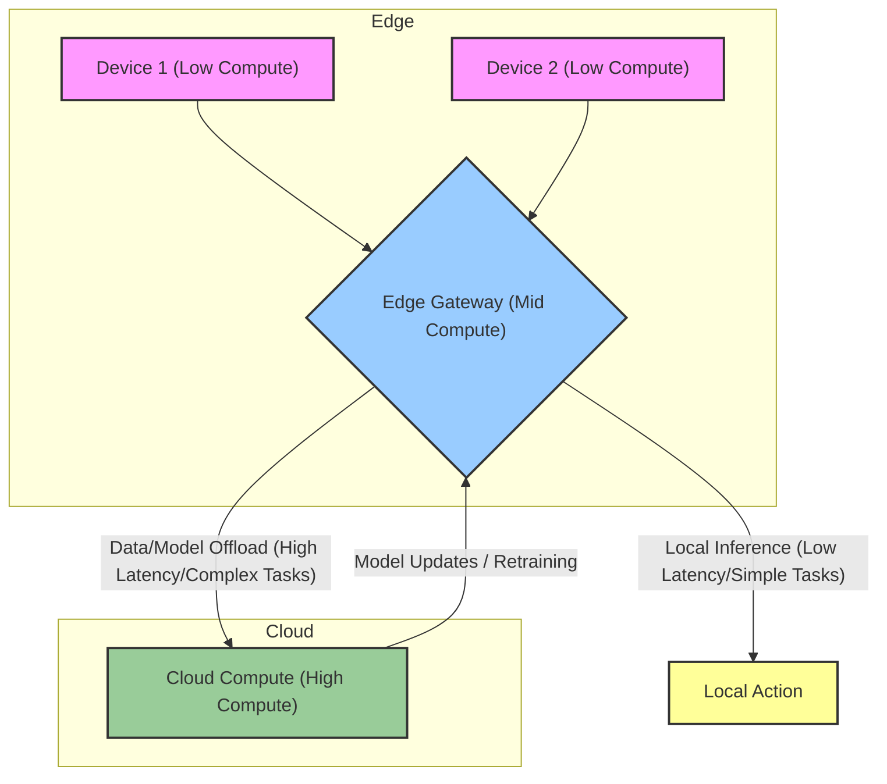
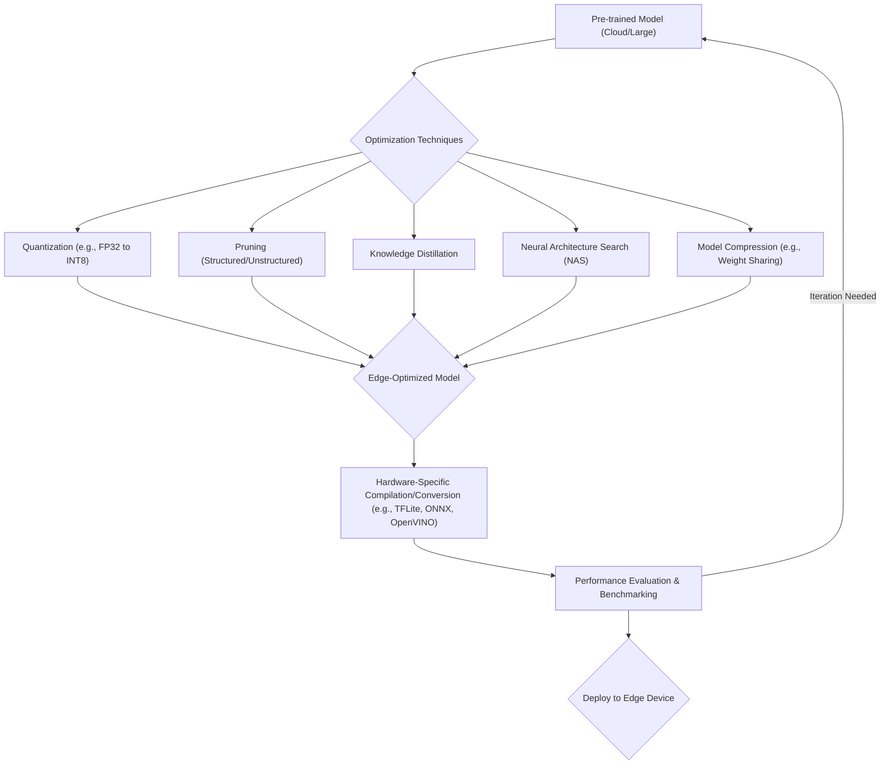
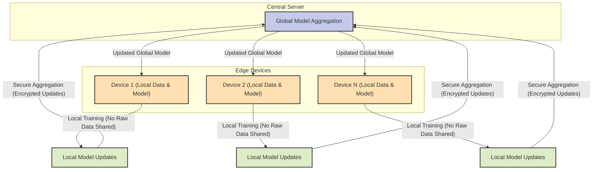

# Edge AI Engineering: A Practical Guide

## Overview

This guide provides a practical framework for understanding the fundamentals of **Edge AI Engineering**. It covers concepts, tools and techniques for designing efficient, reliable and scalable real-world AI applications for resource-constrained devices.

    

    <b>Table of Contents</b>
    

- [Introduction](#introduction)
    - [What is Edge AI?](#what-is-edge-ai)
    - [Benefits of Edge AI](#benefits-of-edge-ai)
    - [Challenges in Edge AI](#challenges-in-edge-ai)
    - [Key Industries and Applications](#key-industries-and-applications)
    - [Edge AI Ecosystem](#edge-ai-ecosystem)
    - [Future Trends](#future-trends)
- [End-to-End Edge AI Stack](#end-to-end-edge-ai-stack)
    - [Architectural Patterns](#architectural-patterns)
    - [Edge-Cloud Continuum](#edge-cloud-continuum)
- [Edge AI MLOps](#edge-ai-mlops)
    - [Real-Time Processing](#real-time-processing)
    - [Optimization Techniques](#optimization-techniques)
    - [Hardware Acceleration](#hardware-acceleration)
    - [Edge Deployment Strategies](#edge-deployment-strategies)
    - [Privacy and Security](#privacy-and-security)
- [Edge AI Frameworks & Toolkits](#edge-ai-frameworks--toolkits)
- [Performance Benchmarking](#performance-benchmarking)
- [Final Considerations](#final-considerations)
- [Resources](#resources)
- [Contributing](#contributing)
- [License](#license)

## Introduction

### What is Edge AI?
Definition and core concepts: Processing AI workloads closer to the data source, minimizing reliance on centralized cloud infrastructure.

Comparison with cloud-based AI:

| **Feature**        | **Edge AI**                                  | **Cloud AI**                                   |
|-----------------|------------------------------------------|--------------------------------------------|
| Latency         | Ultra-low, real-time decisions           | Higher, dependent on network               |
| Bandwidth       | Optimized, less data sent to cloud       | High data transfer needs                   |
| Privacy/Security| Enhanced, data often stays local         | Data transferred, more exposure points     |
| Connectivity    | Offline capabilities, intermittent needs | Requires constant, stable connectivity     |
| Resource        | Resource-constrained (power, compute, memory) | Virtually unlimited resources             |
| Cost            | Lower operational costs for inference    | Higher infrastructure costs for large models|

### Benefits of Edge AI
- **Reduced latency**: Critical for real-time applications like autonomous vehicles and industrial automation.
- **Enhanced privacy and security**: Sensitive data can be processed locally, reducing transmission risks.
- **Bandwidth optimization**: Only relevant insights or aggregated data are sent to the cloud, saving costs.
- **Offline capabilities**: Enables operation in environments with limited or no connectivity.
- **Sustainability / Energy Efficiency:** Growing focus on minimizing power consumption at the edge.

### Challenges in Edge AI
- **Resource constraints**: Limited compute, memory, and power budget on edge devices.
- **Model optimization**: Compressing complex models without significant accuracy loss.
- **Power efficiency**: Designing solutions for long battery life or minimal power draw.
- **Heterogeneous hardware**: Developing solutions compatible with diverse chip architectures (CPUs, GPUs, FPGAs, ASICs, NPUs).
- **MLOps for Edge:** Managing the entire ML lifecycle (training, deployment, monitoring, updating) for distributed edge devices.
- **Connectivity and Orchestration:** Managing vast numbers of devices and ensuring seamless edge-cloud interaction.

### Key Industries and Applications
- **Autonomous Systems:** Real-time object detection, path planning, predictive maintenance (e.g., self-driving cars, drones, robotics).
- **Healthcare:** Medical imaging analysis (e.g., portable ultrasound, real-time patient monitoring via wearables, AI-powered diagnostics on-device).
- **Retail:** Inventory management, customer analytics, personalized experiences (e.g., smart shelves, cashier-less stores).
- **Security:** Intelligent surveillance, anomaly detection (e.g., smart cameras with on-device face/object recognition).
- **Agriculture:** Crop monitoring, yield prediction, pest detection (e.g., smart agricultural robots, IoT sensors).
- **Manufacturing:** Quality control, predictive maintenance, human-robot collaboration (e.g., AI vision systems on production lines).
- **Smart Cities:** Traffic management, urban planning, public safety (e.g., intelligent traffic lights, smart waste management).
- **Wearables & Consumer Electronics:** On-device voice assistants, gesture recognition, health monitoring (e.g., smartwatches, AR/VR devices).

### Edge AI Ecosystem
- **Hardware:** Edge devices (microcontrollers, embedded systems, industrial PCs, smartphones), dedicated accelerators (NPUs, VPUs, custom ASICs).
- **Software:** AI frameworks (LiteRT (TensorFlow Lite), PyTorch Mobile), optimization toolkits (OpenVINO, TensorRT), edge orchestration platforms, MLOps tools.
- **Cloud-edge integration:** Hybrid architectures, data synchronization, remote management.
- **Connectivity:** 5G, Wi-Fi 6E, LPWAN technologies (LoRaWAN, NB-IoT).

### Future Trends (SOTA & Ongoing Development)
- **Agentic AI at the Edge:** Moving beyond simple inference to autonomous decision-making and action at the edge, with devices collaborating and self-adapting.
- **Foundation Models / Large AI Models (LAMs) at the Edge:** Significant advancements in deploying highly efficient Small Language Models (SLMs) and optimized versions of larger models on edge devices, enabled by aggressive quantization and pruning. Focus on collaborative fine-tuning of LAMs at the edge for domain-specific tasks.
- **5G and Edge AI Synergy:** 5G's high speed and ultra-low latency are accelerating real-time edge AI applications, especially in autonomous systems and smart factories.
- **Federated Learning Advancements:** Increasingly crucial for privacy-preserving, decentralized model training where data remains on edge devices. More sophisticated secure aggregation protocols and differential privacy techniques.
- **AI-specific Edge Hardware Proliferation:** Continued innovation in specialized NPUs (Neural Processing Units) and ASICs optimized for edge AI, offering extreme efficiency and performance (e.g., dedicated AI chips from Google, Hailo, Qualcomm, Intel, NVIDIA, and embedded NPUs in MCUs).
- **Multimodal AI at the Edge:** Devices increasingly fusing data from multiple sensors (vision, voice, IMU, acoustic) for richer understanding and more complex decision-making.
- **TinyML Maturity:** Growing adoption of TinyML for ultra-low-power microcontrollers, with mature frameworks and toolchains.
- **Edge-Cloud Continuum & Hierarchical AI:** More sophisticated hybrid models where basic filtering happens locally, complex models are offloaded to the cloud, and dynamic model offloading occurs based on latency or compute thresholds.
- **Standardization & Tooling Maturity:** Maturing tools for end-to-end MLOps for edge, including MLIR for optimization portability, improved embedded AI benchmarks (MLPerf Tiny), and advanced lifecycle management.
- **Energy Efficiency as a Design Priority:** AI model architectures and hardware designs increasingly prioritizing energy consumption to meet sustainability goals.

## End-to-End Edge AI Stack

### Architectural Patterns
- **Device-centric Edge AI:** Processing happens entirely on the edge device (e.g., TinyML applications).
- **Gateway-centric Edge AI:** Edge gateway aggregates data from multiple devices, performs local processing, and communicates with the cloud.
- **Hybrid Edge-Cloud Architectures:** Intelligent workload distribution between edge and cloud, leveraging strengths of both.
- **Decentralized/Distributed Edge AI:** Collaborative processing across a network of edge devices (e.g., federated learning).
- **Hierarchical Edge AI:** Multi-layered edge deployments with varying compute capabilities and latency requirements.

### Edge-Cloud Continuum

- **Data Flow and Synchronization:** Strategies for efficient and secure data exchange between edge and cloud.
- **Model Lifecycle Management:** Orchestrating model training (cloud), deployment (edge), monitoring (edge/cloud), and retraining (cloud).
- **Service Mesh for Edge:** Extending service mesh concepts to manage communication and policies across distributed edge services.
- **Dynamic Workload Shifting:** Automatically moving AI inference tasks between edge and cloud based on real-time conditions (network, device load, criticality).

## Edge AI MLOps
MLOps for Edge AI extends traditional MLOps practices to address the unique challenges of distributed, resource-constrained environments.

### Real-Time Processing

#### Latency Optimization
- Pipelining techniques for inference: Maximizing parallel execution of model layers or sequential tasks.
- Memory management for real-time constraints: Efficient buffer management, minimizing data movement.
- Asynchronous processing models: Decoupling inference from data acquisition for smoother operation.
- **Hardware-aware Scheduling:** Leveraging specific hardware features for optimized task scheduling.

#### Streaming Data Handling
- Online learning algorithms: Models that continuously learn from incoming data streams at the edge.
- Adaptive filtering for edge devices: Real-time noise reduction and signal processing.
- Time-series processing optimizations: Efficient algorithms for sensor data analysis (e.g., RNNs, Transformers for time series data optimized for edge).

#### Event-Driven Architectures
- Reactive programming models for edge AI: Responding to sensor triggers and events with minimal delay.
- Sensor fusion in real-time: Combining data from multiple sensors for robust environmental understanding.
- Interrupt-driven processing for power efficiency: Waking up components only when needed.

#### Real-Time Operating Systems (RTOS) Integration
- FreeRTOS, Zephyr OS for edge AI applications: Lightweight OS for constrained devices.
- Deterministic scheduling for AI tasks: Ensuring predictable execution times for critical inference.
- Real-time constraints in neural network execution: Techniques to guarantee inference completion within strict deadlines.

#### Hardware-Software Co-Design
- Custom instructions for AI acceleration: Leveraging ISA extensions for specific AI operations.
- FPGA-based real-time processing: Implementing custom neural network accelerators on reconfigurable hardware.
- Application-specific integrated circuits (ASICs) for low-latency AI: Designing purpose-built chips for maximum efficiency.
- **Domain-Specific Architectures (DSAs):** Tailoring hardware for specific AI tasks (e.g., vision, voice).

#### Industry Applications
- Autonomous vehicles: Real-time object detection, tracking, prediction, and decision-making (e.g., YOLO series, MobileNet, EfficientNet variants optimized for edge).
- Healthcare: Continuous patient monitoring, anomaly detection, medical imaging analysis on portable devices.
- Manufacturing: Real-time quality control, anomaly detection, predictive maintenance.

#### Benchmarking Real-Time Performance
- Worst-case execution time (WCET) analysis: Guaranteeing performance under worst-case scenarios.
- Jitter measurement and mitigation: Minimizing variability in task execution times.
- End-to-end latency profiling: Measuring delay from sensor input to AI output.

### Optimization Techniques

#### Quantization (SOTA: Post-Training Quantization (PTQ) and Quantization-Aware Training (QAT))
- Post-training quantization: Reducing precision of a trained model (e.g., to INT8, INT4, binary) with minimal accuracy loss.
- Quantization-aware training: Training a model with simulated quantization to achieve better performance post-quantization.
- INT8 and mixed-precision techniques: Balancing performance and accuracy by using different precisions for different layers.
- **Adaptive Quantization:** Dynamically adjusting quantization levels based on inference context or device conditions.

#### Pruning (SOTA: Structured Pruning for Hardware Efficiency)
- Magnitude-based pruning: Removing weights below a certain threshold.
- Structured vs. unstructured pruning: Structured pruning is more hardware-friendly, removing entire channels or filters.
- Iterative pruning strategies: Repeatedly pruning and fine-tuning for optimal results.
- **Sparsity-aware Training:** Training models to be inherently sparse and easier to prune.

#### Knowledge Distillation (SOTA: Multi-modal and Cross-modal)
- Teacher-student models: Transferring knowledge from a large, accurate teacher model to a smaller student model.
- Feature-based distillation: Distilling intermediate feature representations.
- Cross-modal distillation for edge devices: Distilling knowledge from one modality (e.g., high-res video) to another (e.g., low-res video or sensor data) for edge inference.

#### Neural Architecture Search (NAS) (SOTA: Hardware-Aware & Differentiable NAS)
- Hardware-aware NAS: Searching for architectures optimized for specific edge hardware constraints (latency, power, memory).
- Differentiable architecture search: Making the search process more efficient by allowing gradients to flow through the architecture search space.
- Once-for-all networks: Training a single super-network that can be specialized to various hardware platforms.

#### Model Compression
- Weight sharing: Reducing unique weights by forcing multiple connections to share the same weight value.
- Tensor decomposition: Approximating large weight tensors with smaller ones.
- Huffman coding for model storage: Lossless compression of model weights.
- **Efficient Network Architectures:** Designing inherently lightweight models (e.g., MobileNetV3, EfficientNetV2, SqueezeNet, GhostNet).

#### Hardware-Specific Optimizations
- NVIDIA TensorRT optimizations: Runtime for high-performance deep learning inference on NVIDIA GPUs.
- Intel OpenVINO toolkit usage: Optimizing and deploying AI models on Intel hardware (CPUs, GPUs, VPUs, FPGAs).
- ARM Compute Library integration: Optimized computer vision and machine learning functions for ARM CPUs and GPUs.
- **Vendor-specific SDKs/Toolchains:** Leveraging specialized libraries for maximum performance on specific AI accelerators (e.g., Google Coral Edge TPU tools, Hailo-8 SDK).

#### Benchmarking and Evaluation
- Metrics: Accuracy, inference latency, throughput, power consumption, energy efficiency, memory footprint.
- Industry-standard benchmarks (MLPerf Edge, AI Benchmark): Standardized ways to compare hardware and software performance.
- Real-world performance analysis: Evaluating models in actual deployment scenarios.

### Hardware Acceleration

#### GPU Acceleration
- Mobile GPUs (Adreno, Mali): Widely available in smartphones and embedded systems.
- Embedded GPUs (NVIDIA Jetson series, Raspberry Pi): Popular for robotics, industrial vision, and IoT.
- OpenCL and CUDA optimization techniques: Programming paradigms for GPU acceleration.

#### FPGA Solutions
- High-level synthesis (HLS) for AI: Designing custom AI accelerators using high-level languages (C/C++).
- FPGA-based neural network accelerators: Implementing CNNs, RNNs, and Transformers directly on FPGA fabric.
- Dynamic reconfiguration for adaptive AI: Reconfiguring FPGA logic on-the-fly for different AI tasks.
- **Adaptive Edge AI Modules (e.g., AMD Xilinx Kria K26 SOM):** Combining programmable logic with embedded processors for flexible vision and robotics solutions.

#### ASIC Accelerators
- Google Edge TPU: Specialized chip for LiteRT (TensorFlow Lite) inference, known for high TOPS/Watt.
- Intel Movidius VPU: Low-power vision processing units for AI inference.
- Customized AI chips for edge devices (e.g., Hailo-8, Ambarella CVflow, various startups): Tailored for specific workloads like computer vision or audio processing, offering superior efficiency.

#### NPU Integration (SOTA: Ubiquitous in Modern SoCs)
- Smartphone NPUs (Apple Neural Engine, Huawei Kirin NPU, Qualcomm AI Engine): Delivering high on-device AI performance.
- Dedicated NPUs for IoT devices: Embedding AI capabilities directly into low-power IoT chips.
- Programming models for NPUs: APIs and SDKs to leverage NPU capabilities.
- **MCU Vendors with Embedded NPUs/DSPs:** Microcontroller units (MCUs) increasingly integrate specialized processing units for quantized ML models (e.g., NXP i.MX 9 series with Ethos-U NPUs).

#### Heterogeneous Computing
- CPU-GPU-NPU collaboration: Orchestrating workloads across different processing units for optimal performance.
- Workload balancing across accelerators: Dynamically assigning tasks to the most suitable hardware.
- Unified memory architectures: Reducing data transfer overhead between different processing units.

#### Power Efficiency Techniques
- Dynamic voltage and frequency scaling (DVFS): Adjusting power based on workload.
- Sparse computation optimization: Exploiting sparsity in neural networks to save computation.
- Event-driven processing: Minimizing idle power consumption by only activating components when needed.
- **Low-power AI Architectures:** Designing models and hardware specifically for minimal energy footprint.

#### Emerging Technologies
- Neuromorphic computing for edge AI: Mimicking brain structures for highly energy-efficient AI (e.g., Intel Loihi).
- Photonic computing potential: Using light for computation, promising ultra-fast and low-power AI.
- Quantum-inspired algorithms for edge devices: Exploring how quantum computing principles can accelerate classical AI on edge devices.

### Edge Deployment Strategies

#### Containerization for Edge AI
- Docker containers for edge devices: Packaging AI applications for consistent deployment.
- Kubernetes for edge orchestration (e.g., KubeEdge, OpenYurt, k3s): Managing and scaling containerized workloads on distributed edge clusters.
- Lightweight alternatives (e.g., Balena, microk8s): Optimized container solutions for resource-constrained edge devices.

#### Over-the-Air (OTA) Updates (SOTA: Secure Delta Updates, Atomic Rollbacks)
- Secure OTA protocols: Ensuring integrity and authenticity of updates.
- Delta updates for resource-constrained devices: Transmitting only the changed parts of a model or software.
- Rollback mechanisms and version control: Ability to revert to previous versions in case of issues.
- **Immutable Infrastructure for Edge:** Deploying read-only images for enhanced security and simplified updates.

#### Edge Orchestration (SOTA: Advanced Load Balancing, Distributed Model Serving)
- Distributed model serving: Deploying and managing multiple AI models across a fleet of edge devices.
- Load balancing and auto-scaling: Distributing inference requests and scaling resources dynamically at the edge.
- Service mesh for edge AI applications: Enhancing communication, observability, and security between edge services.
- **Policy-driven Deployment:** Automating deployments based on business rules, security policies, and resource availability.

#### CI/CD for Edge AI (SOTA: End-to-End MLOps Pipelines for Edge)
- Automated testing for edge deployments: Validating model performance and software integrity on target hardware.
- Continuous monitoring and retraining: Tracking model drift and triggering retraining pipelines.
- A/B testing in edge environments: Deploying multiple model versions to different devices to compare performance.
- **Shadow Inference:** Running new models alongside production models to validate performance before full rollout.
- **Performance Telemetry:** Collecting detailed performance metrics from edge devices for continuous optimization.

#### Multi-Tenancy and Resource Allocation
- Isolation techniques for shared edge resources: Ensuring different applications or users don't interfere with each other.
- Quality of Service (QoS) management: Prioritizing critical AI tasks on edge devices.
- Dynamic resource allocation based on priorities: Adapting resource usage based on real-time needs.

#### Edge-Cloud Synergy
- Hybrid deployment models: Leveraging the strengths of both edge and cloud.
- Data synchronization strategies: Efficiently moving data between edge and cloud for training, logging, and analysis.
- Fallback mechanisms to cloud: Ensuring continuous operation even if edge processing fails.

#### Industry-Specific Deployment Considerations
- Autonomous systems: Safety-critical deployments, redundancy, real-time safety validation.
- Healthcare: HIPAA-compliant edge AI, secure data handling, regulatory adherence.
- Retail: Distributed deployment across store networks, remote management of numerous devices.
- **Industrial IoT (IIoT):** Integration with OT networks, low-latency requirements, ruggedized deployments.

### Privacy and Security (SOTA: Zero Trust, Homomorphic Encryption, Secure Enclaves)

#### Data Protection at the Edge
- Local data processing techniques: Minimizing data egress.
- Encryption for edge storage and communication: Securing data at rest and in transit.
- Differential privacy in edge analytics: Adding noise to data to protect individual privacy while enabling aggregated insights.

#### Secure Inference (SOTA: Trusted Execution Environments, Homomorphic Encryption)
- Homomorphic encryption for private inference: Performing computations on encrypted data without decrypting it.
- Secure multi-party computation (SMC) in distributed edge AI: Enabling collaborative computation on private data without revealing individual inputs.
- Trusted execution environments (TEE) for edge devices (e.g., ARM TrustZone, Intel SGX): Creating isolated, secure environments for sensitive code and data (like AI models and keys).

#### Device Hardening (SOTA: Secure Boot, Runtime Integrity)
- Secure boot and attestation: Verifying software integrity from boot-up.
- Runtime integrity checking: Continuously monitoring for unauthorized modifications.
- Tamper-resistant hardware integration: Protecting against physical attacks.
- **Authenticated Model Provenance:** Verifying that models are legitimate and untampered with (e.g., via SBOMs, digital signatures).

#### Federated Learning for Privacy (SOTA: Enhanced Aggregation, Personalized FL)

Federated Learning is a key approach to privacy-preserving AI at the edge.

- Decentralized model training: Training models on distributed edge data without centralizing raw data.
- Secure aggregation protocols: Combining local model updates securely.
- Differential privacy in federated learning: Adding noise to model updates to further protect individual data contributions.
- **Personalized Federated Learning:** Adapting global models to individual device characteristics while maintaining privacy.

#### Adversarial Attacks and Defenses
- Adversarial example generation on edge devices: Understanding how malicious inputs can fool edge AI models.
- Robust inference techniques: Developing models resilient to adversarial attacks.
- Detection and mitigation of model poisoning: Protecting models from malicious data injection during training or updates.
- **Explainable AI (XAI) at the Edge:** Understanding model decisions to identify potential vulnerabilities.

#### Regulatory Compliance
- GDPR considerations for edge AI: Ensuring data protection and privacy in Europe.
- HIPAA compliance in healthcare edge applications: Protecting patient health information.
- Industry-specific data protection standards: Adhering to sector-specific regulations.

#### Privacy-Preserving Computer Vision
- Face anonymization techniques: Blurring or masking faces in real-time.
- Privacy-aware object tracking: Tracking objects without identifying individuals.
- Consent management in smart cameras: Implementing mechanisms for user consent.

### Edge AI Frameworks & Toolkits

#### LiteRT (TensorFlow Lite)
- Model conversion and optimization: Tools to convert TensorFlow models for edge deployment.
- Delegate support for hardware acceleration: Leveraging specialized hardware (e.g., Edge TPU delegate).
- On-device training capabilities: Limited but growing support for training or fine-tuning models directly on edge devices.
- **TensorFlow Lite Micro:** Optimized for microcontrollers (TinyML).

#### ExecuTorch (PyTorch Mobile)
- Model preparation for mobile deployment: Tools like TorchScript for serialization.
- Quantization and pruning in PyTorch: Native support for optimization techniques.
- Integration with mobile development frameworks: Easier integration into iOS/Android apps.

#### ONNX Runtime
- Cross-platform model deployment: Supports various hardware and operating systems.
- Hardware acceleration with ONNX Runtime: Leverages execution providers for different backends (CUDA, OpenVINO, DirectML).
- Custom operator implementation: Extending functionality for specific model architectures.
- **ONNX for Microcontrollers:** Efforts to bring ONNX Runtime capabilities to highly constrained devices.

#### OpenVINO (Intel's Open Visual Inference & Neural Network Optimization)
- Model optimization toolkit usage: Comprehensive tools for optimizing models for Intel hardware.
- Inference engine deployment: High-performance runtime for inference.
- Integration with OpenCV for computer vision: Seamless integration for vision-based applications.

#### Edge Impulse
- Embedded machine learning workflow: End-to-end platform for TinyML development.
- Sensor data collection and processing: Tools for gathering and preparing sensor data.
- Deployment to microcontrollers and edge devices: Generating highly optimized firmware.

#### Apache TVM
- Compiler-based optimizations for edge devices: Optimizing models for diverse hardware targets through a unified compilation stack.
- Automated tuning for diverse hardware targets: AutoTVM and AutoScheduler for performance optimization.
- Runtime systems for efficient inference: Lightweight runtime for deployment.

#### Framework Comparison (SOTA: Focus on ease of use, hardware compatibility, and MLOps integration)

| Framework            | Primary Devices                     | Key Features                                   | Hardware Compatibility                  | MLOps Integration                           |
|----------------------|-------------------------------------|------------------------------------------------|-----------------------------------------|---------------------------------------------|
| **[LiteRT (TensorFlow Lite)](https://github.com/google-ai-edge/LiteRT)** | Mobile, Embedded, Microcontrollers  | Quantization, Delegates, On-device training   | Broad (CPU, GPU, Edge TPU, DSP)         | Good, integrated with TF ecosystem          |
| **[ExecuTorch (PyTorch Mobile)](https://github.com/pytorch/executorch)** | Mobile, Embedded                     | TorchScript, Quantization, Easy Dev Workflow   | Broad (CPU, GPU)                         | Growing, leverages PyTorch ecosystem        |
| **[ONNX Runtime](https://github.com/microsoft/onnxruntime)** | Cross-platform (Edge, Cloud, Mobile)| Standard model format, various execution providers | Broad (CPU, GPU, VPU, NPU, FPGA)        | Good, interoperable with many tools         |
| **[OpenVINO](https://github.com/openvinotoolkit/openvino)** | Intel Hardware (CPU, GPU, VPU, FPGA)| Model Optimization, Inference Engine, CV focus | Intel-specific (high performance)       | Strong for Intel-centric solutions          |
| **[Edge Impulse](https://edgeimpulse.com/)** | Microcontrollers, IoT Devices       | End-to-end TinyML workflow, Data Management    | Microcontrollers, specific dev boards   | Excellent for embedded ML projects          |
| **[Apache TVM](https://github.com/apache/tvm)** | Diverse Hardware (Deep Customization)| Compiler-based optimization, Auto-tuning, Runtime | Highly Flexible (CPU, GPU, NPU, FPGA)   | Lower-level, requires more expertise         |
| **[NVIDIA TensorRT](https://developer.nvidia.com/tensorrt)** | NVIDIA GPUs (Jetson series)         | High-performance inference, Graph optimization | NVIDIA GPU-specific (Jetson, etc.)      | Strong for NVIDIA-based deployments         |
| **[Qualcomm AIMET](https://github.com/quic/aimet)** | Mobile, Embedded, Edge Devices    | Quantization-aware training, Post-training quantization, Cross-layer equalization, BatchNorm folding | Qualcomm SoCs (Snapdragon), CPU, GPU, DSP     | Integrates with TensorFlow & PyTorch, supports deployment workflows       |

- Further Reading: [Edge AI Frameworks core guides](https://github.com/afondiel/computer-science-notebook/tree/master/core/systems/edge-computing/edge-ai/concepts/frameworks)

## Performance Benchmarking

### Metrics for Edge AI
- Inference latency and throughput: Speed of model execution and number of inferences per second.
- Model accuracy and precision: How well the optimized model performs compared to the original.
- Power consumption and energy efficiency: Key for battery-powered devices and sustainability.
- Memory footprint and bandwidth usage: Model size, RAM usage, and data transfer requirements.
- **Jitter and Determinism:** Consistency of performance, especially for real-time safety-critical applications.
- **Model Size (Parameters/Memory):** Directly impacts deployability on constrained devices.

### Benchmarking Tools
- **MLPerf Edge suite:** Industry-standard benchmarks for various edge AI tasks and hardware.
- **AI Benchmark:** Mobile device AI performance benchmarking.
- **Custom benchmarking frameworks:** Tailored tools for specific use cases and custom hardware.
- **Embedded AI Benchmarks (e.g., MLPerf Tiny):** Specifically for microcontrollers and deeply embedded systems.

### Performance Optimization Strategies

- Model architecture modifications: Choosing lightweight models or designing custom efficient architectures.
- Quantization fine-tuning: Iterative refinement of quantization parameters.
- Kernel optimization for specific hardware: Writing highly optimized code for target processors.
- Memory access pattern optimization: Arranging data to maximize cache utilization.
- **Compiler Optimizations:** Leveraging tools like Apache TVM or MLIR for hardware-aware code generation.
- **Profiling and Bottleneck Analysis:** Identifying performance bottlenecks at the hardware and software layers.

### Industry-Specific Benchmarks
- Autonomous systems: Real-time object detection metrics (mAP, FPS), lane keeping accuracy, prediction latency.
- Healthcare: Medical image segmentation performance (Dice score, Hausdorff distance), diagnostic accuracy, inference time for critical alerts.
- Retail: Customer behavior analysis accuracy, footfall counting efficiency, privacy-preserving metrics.
- **Manufacturing:** Anomaly detection accuracy, cycle time prediction, false positive rates for defect detection.

### Profiling Techniques
- CPU/GPU profiling tools for edge devices: Identifying hotspots and performance bottlenecks (e.g., Arm Streamline, NVIDIA Nsight).
- Power profiling and thermal analysis: Measuring energy consumption and managing heat dissipation.
- Memory usage and cache performance optimization: Analyzing memory access patterns and optimizing data structures.
- **System-level Profiling:** Understanding interaction between OS, drivers, and AI applications.

### Continuous Performance Monitoring
- Telemetry collection from edge devices: Gathering real-time performance data.
- Performance degradation detection: Identifying when a deployed model's performance drops.
- Automated retraining and model updates: Triggering MLOps pipelines based on performance metrics or drift detection.

### Best Practices

- Hardware-software co-design for optimal performance: Designing AI models and hardware in conjunction.
- Balancing accuracy and efficiency trade-offs: Understanding where to compromise for practical deployment.
- Scalability considerations for large-scale deployments: Designing systems that can grow with increasing device numbers.
- **Iterative Development:** Continuously refining models and deployments based on real-world feedback.
- **Observability:** Implementing robust logging, monitoring, and alerting for edge AI systems.

## Final Considerations

### Ethical AI and Responsible Development
- **Bias detection and mitigation:** Ensuring fairness in AI models deployed at the edge.
- **Explainability and Interpretability (XAI):** Understanding why an edge AI model makes certain decisions.
- **Consent and Transparency:** Clear communication about data collection and AI usage.

### Sustainability in Edge AI
- **Energy-efficient hardware design:** Prioritizing low-power components.
- **Green AI algorithms:** Developing models that require less computational energy.
- **Lifecycle carbon footprint:** Considering the environmental impact from manufacturing to deployment.

### Interoperability and Standardization
- **Open standards for model exchange (e.g., ONNX):** Facilitating model portability.
- **Standardized APIs for device management:** Simplifying edge device orchestration.
- **Collaborative ecosystems:** Fostering innovation through shared tools and knowledge.

## Resources

*A curated list of essential resources for Edge AI Engineering.*

### **Online Courses & Tutorials:**

- Edge AI courses from NVIDIA, Intel, Google (e.g., NVIDIA Deep Learning Institute, Google Coral documentation).
- Coursera, Udacity, edX courses on Embedded AI, TinyML.

### **Key Research Papers & Publications:**

- Top conferences: NeurIPS, ICML, CVPR, ICCV, ECCV, AAAI (search for "edge AI," "model compression," "federated learning").
- ArXiv pre-prints on SOTA techniques.

### **Open-Source Projects & Repositories:**

- LiteRT (TensorFlow Lite), PyTorch Mobile, ONNX Runtime, Apache TVM.
- Edge Impulse, OpenVINO, NVIDIA Jetson repositories.
- Repositories for specific lightweight models (e.g., MobileNet, EfficientNet, YOLO variants).

### **Books & Technical Guides:**

- "TinyML: Machine Learning with LiteRT (TensorFlow Lite) on Arduino and Ultra-Low-Power Microcontrollers" by Pete Warden and Daniel Situnayake.
- Books on MLOps and embedded systems.

### **Industry Reports & Analyst Insights:**

- Gartner, Forrester, IoT Analytics, IDC reports on Edge AI market trends and predictions.

### **Community Forums & Blogs:**
- Specific forums for NVIDIA Jetson, Google Coral, Edge Impulse.
- Blogs from major tech companies (Intel, ARM, Qualcomm) and AI research labs.

## Contributing

We welcome contributions from the community! Your expertise helps make this the ultimate guide for Edge AI Engineering. Please see our [CONTRIBUTING.md](CONTRIBUTING.md) file for details on how to submit improvements, suggest new sections, or report issues.

## License

This project is licensed under the MIT License - see the [LICENSE](LICENSE) file for details.
